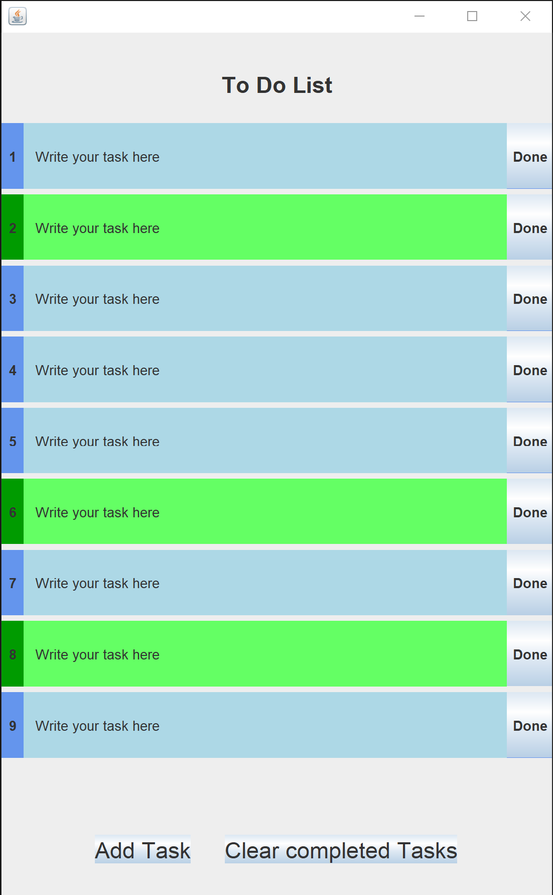

# ToDoList



## Description

ToDoList is a simple Java Swing-based application that allows users to manage their daily tasks through an intuitive, lightweight interface. It demonstrates modular programming in Java, clean code architecture, and event-driven GUI design.

## Features

* Add, edit, and delete tasks
* Mark tasks as complete/incomplete
* Persistent storage of tasks between sessions
* Responsive, resizable window layout
* Modular code organization using Java 9+ modules

## Prerequisites

* Java Development Kit (JDK) 11 or higher
* Maven or your preferred Java build tool

## Project Structure

```
classes/
├── module-info.java        # Module declaration
├── ToDoList.java           # Main launcher class
├── AppFrame.java           # Main frame containing GUI components
├── TitleBar.java           # Custom title bar component
├── Footer.java             # Footer panel with status/info
├── List.java               # Panel displaying the list of tasks
└── Task.java               # Model class for a task
```

## Installation & Running

1. **Clone the repository**

   ```bash
   git clone https://github.com/yourusername/ToDoList.git
   cd ToDoList
   ```

2. **Build the project**

   ```bash
   mvn clean package
   ```

   *Or* compile manually:

   ```bash
   javac -d out --module-source-path src $(find src -name "*.java")
   ```

3. **Run the application**

   ```bash
   java --module-path out -m ToDoList/com.example.todolist.ToDoList
   ```

## Usage

* Click the **+** button or press **Enter** in the input field to add a new task.
* Double-click a task to edit its description.
* Click the checkbox next to a task to mark it complete or incomplete.
* Click the **✖** button on a task to delete it.
* Use the **File** menu to export or import task lists (future enhancement).

## Screenshots


## Contributing

Contributions are welcome! Please open issues for bugs or feature requests, and submit pull requests for improvements.

## License

This project is licensed under the MIT License. See the [LICENSE](LICENSE) file for details.
